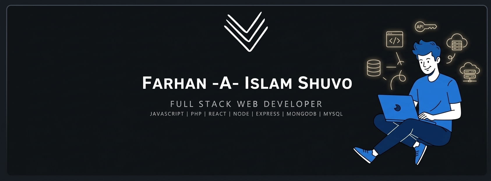

  

## Full Stack Web Developer 🚀 | JavaScript, React, Node.js, Express.js, MongoDB, PHP, MySQL | Building modern, scalable websites 🌐

---

## 🙋‍♂️ About Me

- 🔭 I'm currently working with JS, React.js, PHP, MySQL
- 🚀 I'm currently exploring Next.Js
- 🌱 I'm continuously learning and improving my skills
- 📫 Reach me at: **farhanislam395@gmail.com**

---

## 🧩 Work Style

  
  
  
  

---

## 🛠️ Tech Stack

### Frontend

  

### Backend

  

### Database

  

### Tools & Platforms

  

---

### 🔥 GitHub Streak

  

---

## 🌐 Connect With Me

  

---
